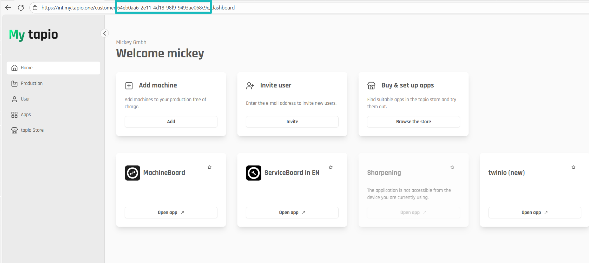
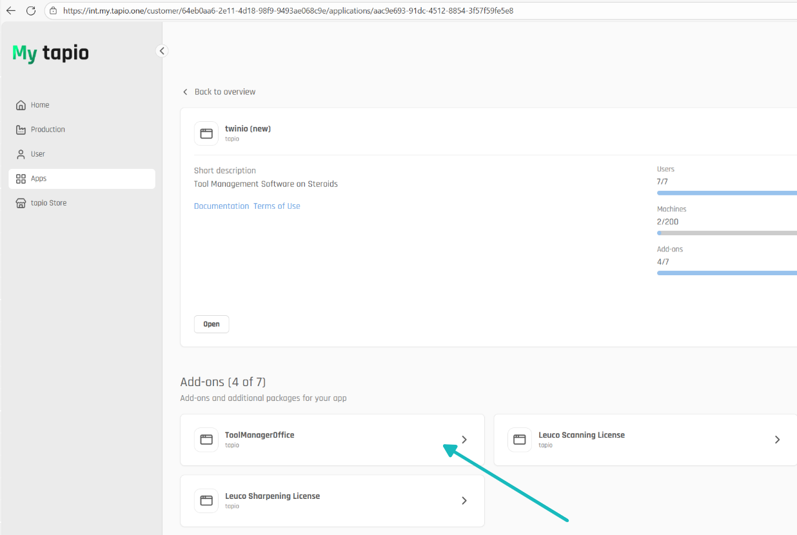
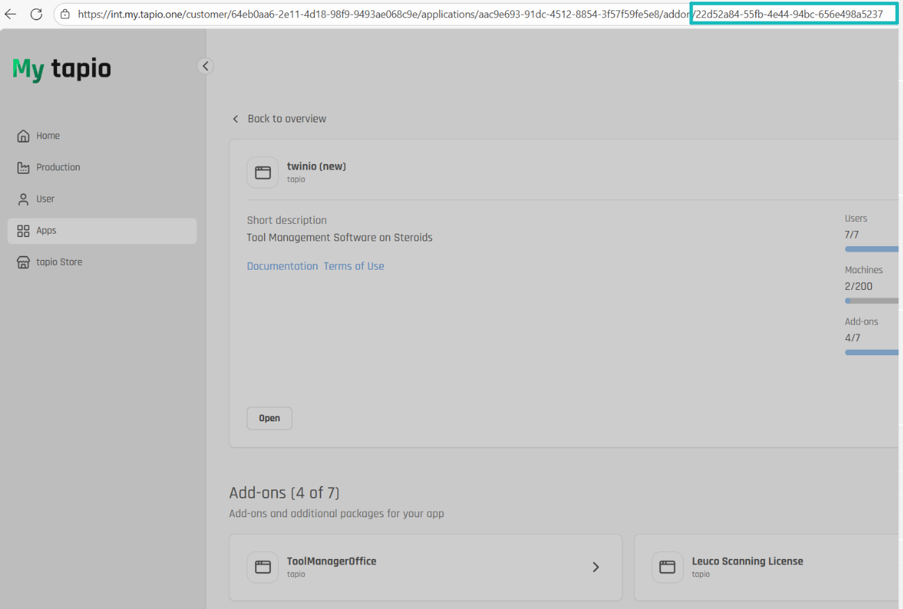
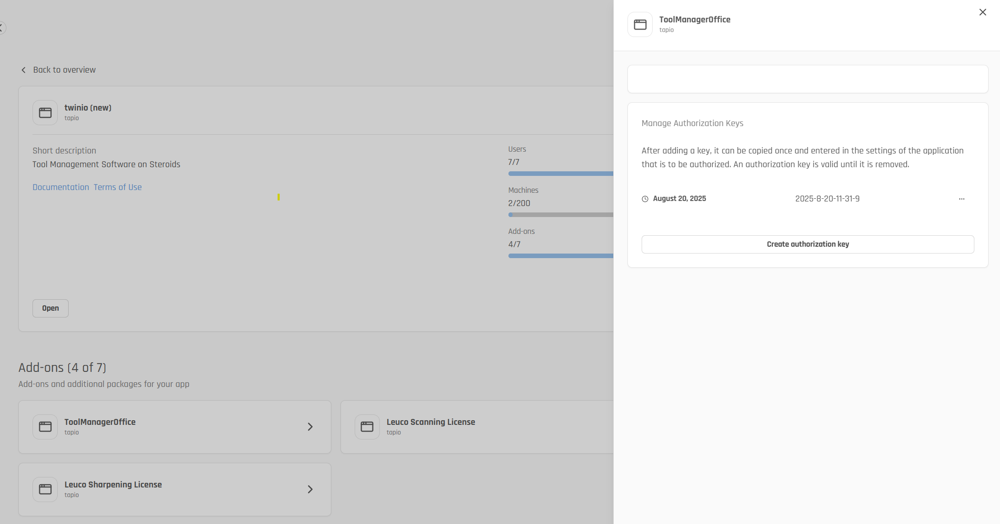
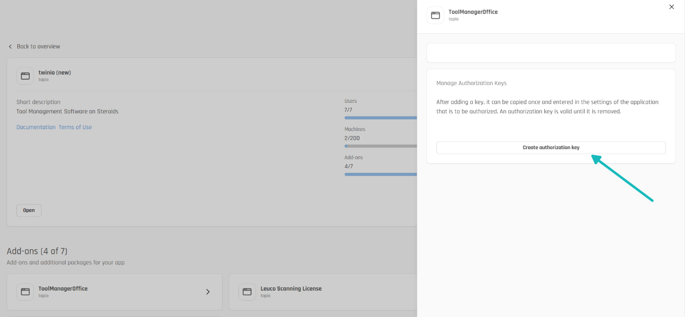
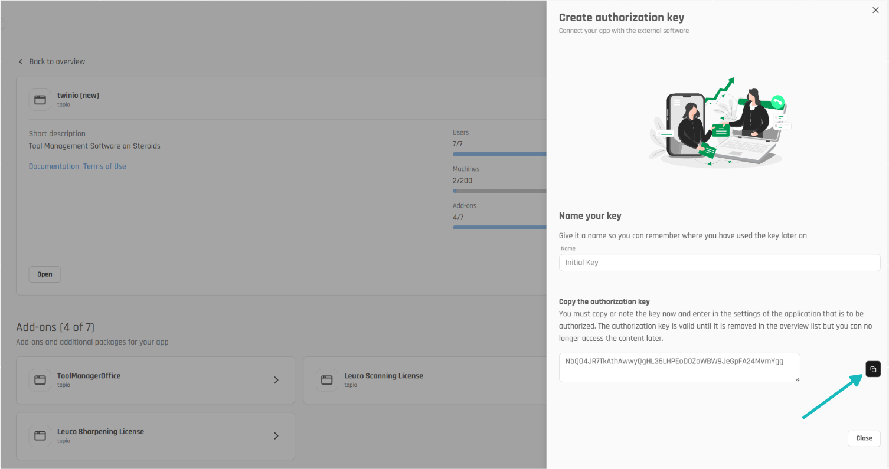

# Authentication

This documentation explains how to authenticate with tapio API clients using basic authentication. The examples demonstrate authentication with various tapio services including Tadamo and MaintenanceService APIs.

To create an instance of any tapio API client, you will need a Subscription Id, Application Id, and an Authorization Key.

```csharp
// Example: Create new instance of the Tadamo API client:
var httpClient = new HttpClient();

var basicApiClientConfig = new TadamoBasicApiClientConfig
{
    ApplicationId = applicationId.ToString(),
    SubscriptionId = subscriptionId.ToString(),
    BaseUrl = "https://api.tapio.one/tadamo",
    Base64Hash = Convert.ToBase64String(System.Text.Encoding.UTF8.GetBytes(authorizationKey))
};

var tadamoApiClient = new TadamoApiClient(httpClient, basicApiClientConfig);
```

The Subscription Id, Application Id, and Authorization Key can be obtained by subscription administrators following these steps:

- Log in to your Tapio account at <https://my.tapio.one>

- Copy the Subscription Id from the browser bar



- Navigate to your desired application in the applications section

- Navigate to the addon



- Copy the Application Id of the addon from the browser bar



- Open the Authorization Keys dialog



- Click on "Create authorization key" to create a new key
  Enter a meaningful description for your authorization key so that you can easily identify the correct key later if you wish to revoke it



- Copy the generated Authorization Key



**Note:** Make sure to keep your authorization key confidential as it provides authorized access to the tapio APIs.

## Error Handling

When working with tapio API clients, implement proper error handling to manage different HTTP status codes:

```csharp
try
{
    // API call example for Tadamo
    var toolsCount = await tadamoApiClient.GetToolsCountAsync(subscriptionId);
    Console.WriteLine($"Tools count: {toolsCount}");
}
catch (TadamoApiException e) when (e.StatusCode == 401)
{
    Console.WriteLine("Unauthorized: Please check your authorization key and credentials.");
}
catch (TadamoApiException e) when (e.StatusCode == 403)
{
    Console.WriteLine("Forbidden: You do not have permission to access this resource.");
}
catch (TadamoApiException e)
{
    Console.WriteLine($"API error ({e.StatusCode}): {e.Message}");
}
catch (Exception ex)
{
    Console.WriteLine($"Unexpected error: {ex.Message}");
}
```

For MaintenanceService API clients, use the corresponding exception type:

```csharp
try
{
    // API call example for MaintenanceService
    var tickets = await maintenanceServiceApiClient.SearchTicketsAsync(subscriptionId, new TicketsSearchRequest());
    Console.WriteLine($"Maintenance tickets count: {tickets.Data.Count}");
}
catch (MaintenanceServiceApiException e) when (e.StatusCode == 401)
{
    Console.WriteLine("Unauthorized: Please check your authorization key and credentials.");
}
catch (MaintenanceServiceApiException e) when (e.StatusCode == 403)
{
    Console.WriteLine("Forbidden: You do not have permission to access this resource.");
}
catch (MaintenanceServiceApiException e)
{
    Console.WriteLine($"API error ({e.StatusCode}): {e.Message}");
}
catch (Exception ex)
{
    Console.WriteLine($"Unexpected error: {ex.Message}");
}
```

The file [AuthenticationSamples.cs](https://github.com/tapioone/tapio-samples/blob/master/Source/Tapio.Authentication/Tapio.Authentication/AuthenticationSamples.cs) provides complete examples for authentication with different tapio API clients.
